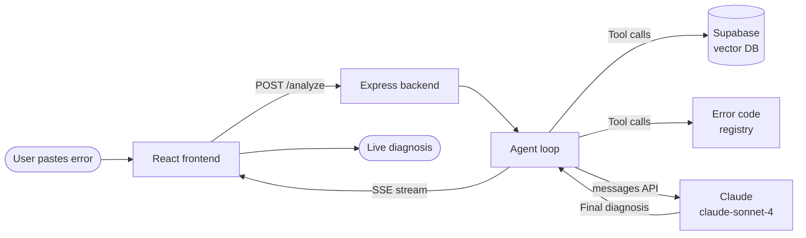
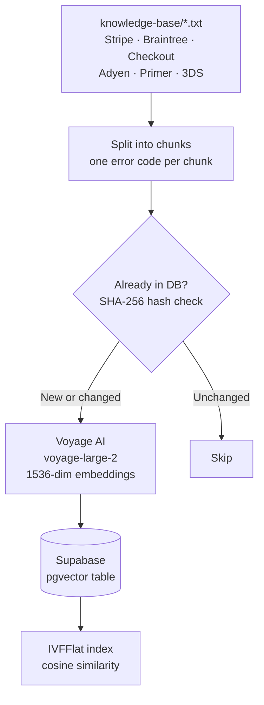
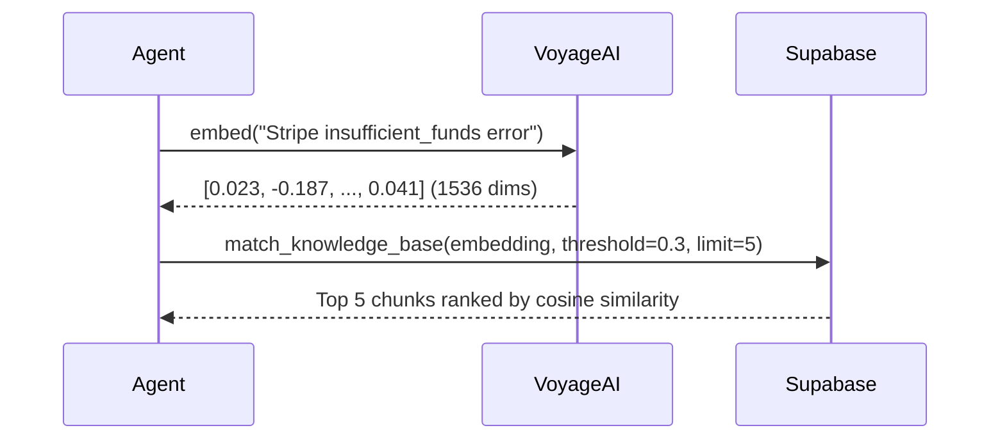
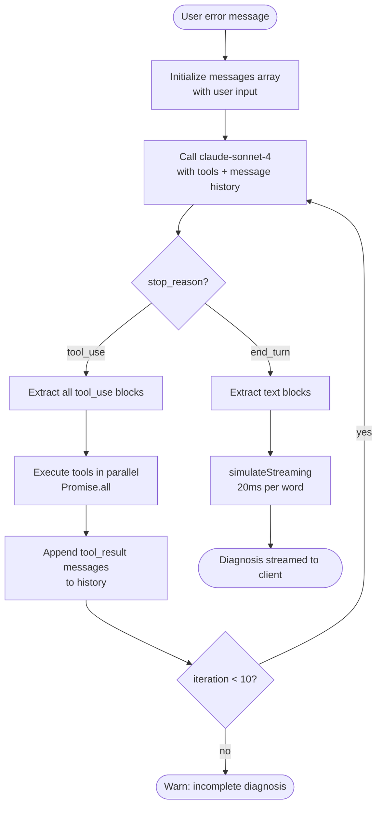

# Pay Trace AI

An AI-powered payment error debugger. Paste any payment error code or message — from Stripe, Braintree, Checkout.com, Adyen, Primer, or 3D Secure — and get a structured diagnosis with root cause, retryability, and a recommended fix.

Built to demonstrate three core AI engineering concepts: **RAG (Retrieval-Augmented Generation)**, **Claude API tool use**, and **agentic loops**.

---

## How It Works — High Level



The user's error is sent to an **agentic loop** that gives Claude access to tools. Claude decides which tools to call, in what order, and uses the results to write a structured diagnosis. The diagnosis is streamed back word-by-word to the frontend.

---

## Part 1 — RAG Pipeline

RAG (Retrieval-Augmented Generation) solves the problem of LLMs not knowing your private data. Instead of fine-tuning, you store your documents as vectors and retrieve the relevant chunks at query time.

### 1a. Ingestion (offline, run once)



**Script:** `backend/scripts/ingest.cts`

Each `.txt` file in `knowledge-base/` contains documentation for one payment provider. The ingestion script:

1. Splits each file into chunks — one error code per chunk (split on double blank lines)
2. Computes a SHA-256 hash of each chunk for differential sync — only new or changed chunks are re-embedded
3. Sends each chunk to **Voyage AI** (`voyage-large-2` model) which returns a 1536-dimensional float vector
4. Stores the vector + original text + source in Supabase's `knowledge_base` table
5. An IVFFlat index on the `embedding` column enables fast approximate nearest-neighbour search

### 1b. Retrieval (at query time)



**File:** `backend/src/rag/search.ts`

When the `search_knowledge_base` tool is called, it:
1. Embeds the query string using the same Voyage AI model used during ingestion — this puts the query into the same vector space as the stored chunks
2. Calls a Supabase RPC function `match_knowledge_base()` which runs a cosine similarity search using pgvector
3. Returns the top 5 chunks with their similarity scores, source (PSP name), and full content

The key insight: **similarity search works semantically**, not lexically. A query like `"not enough money"` will match chunks containing `"insufficient_funds"` because they're geometrically close in the embedding space.

---

## Part 2 — Claude API & Tool Use

Tool use (also called function calling) lets you give Claude access to external data sources or actions. Claude doesn't call your tools directly — it tells you *which* tool to call and *with what arguments*, you run it, and you send the result back.

### Tool definitions

**File:** `backend/src/tools/definitions.ts`

You define tools as JSON schema objects passed to the Claude API. Claude reads the `description` fields to decide when and how to use each tool.

```typescript
{
  name: "search_knowledge_base",
  description: "Semantic search through PSP documentation. Use this first with error keywords.",
  input_schema: {
    type: "object",
    properties: {
      query: { type: "string", description: "Error code, message, or natural language description" }
    },
    required: ["query"]
  }
}
```

Three tools are registered:

| Tool | What it does | When Claude uses it |
|------|-------------|-------------------|
| `search_knowledge_base` | Semantic RAG search → Voyage AI → Supabase | Always first — finds relevant doc chunks |
| `lookup_error_code` | Direct lookup in static registry (~500 codes) | After a specific code is identified |
| `check_psp_status` | Checks if a provider has an active outage | Only when error looks like a provider-side failure |

---

## Part 3 — The Agentic Loop

This is what makes the system "agentic": Claude drives the workflow. You don't script the sequence of tool calls — Claude decides what information it needs, asks for it, and iterates until it has enough to answer.



**File:** `backend/src/agent/loop.ts`

### How a real run looks

```
Iteration 1
  You → Claude: "Stripe returned insufficient_funds on checkout"
  Claude → You: tool_use { name: "search_knowledge_base", input: { query: "Stripe insufficient_funds" } }

Iteration 2
  You → Claude: tool_result { content: "CODE: insufficient_funds\nMeaning: Card has insufficient funds..." }
  Claude → You: tool_use { name: "lookup_error_code", input: { code: "insufficient_funds", provider: "stripe" } }

Iteration 3
  You → Claude: tool_result { content: "Meaning: Insufficient funds, Retryable: true, Fix: Ask customer..." }
  Claude → You: end_turn
  Text: "**Error Code:** insufficient_funds\n**Source:** Stripe\n**Meaning:** The card's available balance..."
```

### The system prompt's role

The system prompt does three things:

1. **Persona** — instructs Claude to reason as a senior payment engineer, not a generic assistant
2. **Tool call order** — forces `search_knowledge_base` first, then `lookup_error_code`, so Claude always grounds its answer in your documentation before using the registry
3. **Critical domain distinction** — explicitly teaches Claude the difference between an *issuer decline* (bank rejected the card: insufficient funds, expired card) and an *API/integration error* (your server code is wrong: Stripe `rate_limit` means you sent too many API requests, not that a card was declined). Without this, Claude would mix them up.

---

## Part 4 — Error Code Registry

**File:** `backend/src/tools/registry.ts`

A static in-memory lookup table with ~500 error codes across 8 providers. Each entry:

```typescript
{
  code: "insufficient_funds",
  meaning: "The card does not have sufficient funds",
  cause: "Cardholder's account balance is too low",
  retryable: true,
  fix: "Ask the customer to use a different card or add funds",
  source: "Stripe"
}
```

**Coverage:** Braintree (2001–2074), Stripe (70+ codes), Checkout.com (100+ codes), Adyen (30+ refusal codes), Primer/Visa/Mastercard (ISO 8583 codes), Toss Payments, PayPal, 3D Secure.

The registry is the fast, deterministic path. The RAG search is the semantic fallback for anything the registry doesn't cover or for natural-language queries.

---

## Part 5 — Streaming to the Frontend

**File:** `backend/src/controllers/analyze.controller.ts`

The response is delivered as Server-Sent Events (SSE). **File:** `frontend/src/hooks/useAnalyze.ts`

The React hook reads the SSE stream with `fetch` + `ReadableStream`, parses each `data:` line, and accumulates the chunks into state. The `DiagnosisResult` component renders the accumulated markdown in real time, giving the live-typing effect.

---

## RAG Search Quality Tests

**File:** `backend/src/rag/test-search.ts`

A standalone test runner (no test framework) that validates RAG retrieval quality across 60+ cases in 8 categories:

| Category | What it tests |
|---|---|
| Exact code matches | `"Stripe code insufficient_funds"` → must return Stripe chunk with similarity ≥ 0.7 |
| Semantic meaning | `"not enough money"` → must find insufficient_funds across providers |
| Mixed providers | Generic terms that should match multiple PSPs |
| Technical vs user language | Developer jargon vs plain English for the same error |
| Fuzzy / typos | `"insufficent funds"`, `"expird card"` — embedding handles these gracefully |
| Edge cases | Ambiguous queries like `"retryable error"` |
| Combined concepts | Multi-term queries with provider + code + intent |
| Negative tests | `"restaurant menu item"` → similarity must stay below threshold |

Each test case checks similarity score, expected source (PSP), and that the expected error code string appears in the returned content. Results are saved to `rag-test-report.json`.

---

## Tech Stack

| Layer | Technology | Role |
|-------|-----------|------|
| LLM | Claude (`claude-sonnet-4`) via Anthropic SDK | Orchestrates tool calls, writes diagnosis |
| Embeddings | Voyage AI (`voyage-large-2`, 1536 dims) | Vectorizes docs and queries |
| Vector DB | Supabase + pgvector (IVFFlat index) | Stores and searches embedded chunks |
| Backend | Node.js + TypeScript + Express | Agent loop, tool execution, SSE |
| Frontend | React + TypeScript + Vite | UI, SSE streaming, markdown rendering |

---

## Project Structure

```
pay-trace-ai/
├── backend/
│   ├── knowledge-base/          # Raw PSP documentation (.txt)
│   │   ├── Stripe.txt
│   │   ├── Braintree.txt
│   │   ├── Checkout.txt
│   │   ├── Adyen.txt
│   │   ├── Primer.txt
│   │   └── 3ds-codes.txt
│   ├── scripts/
│   │   └── ingest.cts           # Ingestion pipeline (run once)
│   ├── src/
│   │   ├── agent/
│   │   │   └── loop.ts          # Agentic loop — the core of the system
│   │   ├── controllers/
│   │   │   └── analyze.controller.ts  # HTTP handler + SSE streaming
│   │   ├── lib/
│   │   │   ├── anthropic.ts     # Anthropic SDK client
│   │   │   └── supabase.ts      # Supabase client
│   │   ├── rag/
│   │   │   ├── search.ts        # Embed query → Supabase cosine search
│   │   │   └── test-search.ts   # RAG quality test suite
│   │   └── tools/
│   │       ├── definitions.ts   # Tool schemas passed to Claude
│   │       ├── executor.ts      # Routes tool calls to implementations
│   │       └── registry.ts      # Static error code lookup table
│   └── supabase/
│       └── migrations/          # DB schema + pgvector setup
└── frontend/
    └── src/
        ├── components/
        │   ├── ErrorInput.tsx    # Input textarea with PSP auto-detection
        │   └── DiagnosisResult.tsx  # Markdown renderer + streaming cursor
        └── hooks/
            └── useAnalyze.ts    # SSE fetch + stream accumulation
```

---

## Setup

### Prerequisites

- Node.js 18+
- A [Supabase](https://supabase.com) project with the pgvector extension enabled
- An [Anthropic API key](https://console.anthropic.com)
- A [Voyage AI API key](https://www.voyageai.com)

### Backend

```bash
cd backend
npm install
cp .env.example .env.local
# Fill in SUPABASE_URL, SUPABASE_SERVICE_KEY, ANTHROPIC_API_KEY, VOYAGE_API_KEY
```

Run the Supabase migration to create the `knowledge_base` table and `match_knowledge_base` RPC:

```bash
# via Supabase CLI or paste supabase/migrations/20240001_init.sql into the SQL editor
```

Ingest the knowledge base (one-time, ~20 min due to Voyage AI rate limits):

```bash
npx tsx scripts/ingest.cts
```

Start the dev server:

```bash
npm run dev   # runs on port 3000
```

### Frontend

```bash
cd frontend
npm install
npm run dev   # runs on port 5173
```

---

## Environment Variables

```bash
# backend/.env.local
PORT=3000
SUPABASE_URL=https://your-project.supabase.co
SUPABASE_ANON_KEY=...
SUPABASE_SERVICE_KEY=...       # used by ingestion script only
ANTHROPIC_API_KEY=sk-ant-...
VOYAGE_API_KEY=pa-...
USE_MOCK_AI=false              # set true to skip Claude/Voyage calls during dev
```
